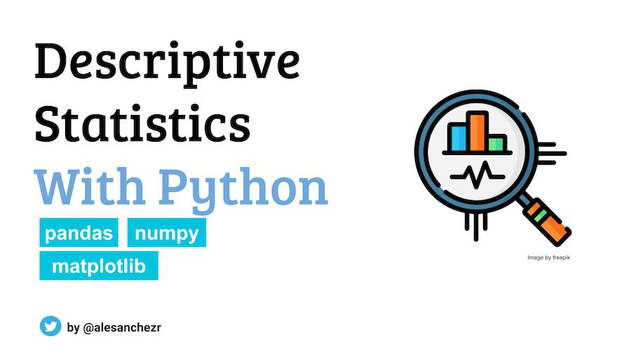
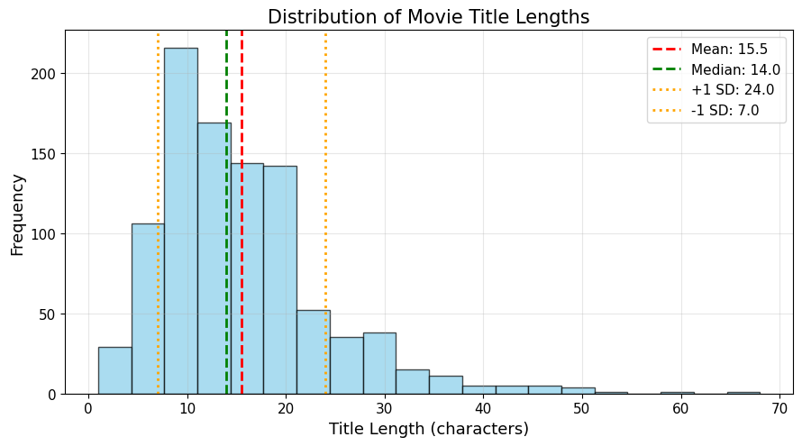

# Descriptive Statistics Exercises Project



## Overview

This project provides hands-on exercises for learning descriptive statistics using Python. You'll work with a real dataset of 1000 popular movies from IMDb to explore various statistical concepts including measures of central tendency, spread, and distribution shape.

## What You'll Learn

- **Data Analysis with Pandas**: Load and manipulate real-world datasets
- **Descriptive Statistics**: Calculate mean, median, mode, range, variance, and standard deviation
- **Distribution Analysis**: Understand skewness and kurtosis
- **Data Visualization**: Create histograms and interpret statistical plots
- **Manual Calculations**: Step-by-step computation of standard deviation

## Project Features

- **Modular Code Structure**: Functions are organized in separate modules for better maintainability
- **Comprehensive Testing**: Unit tests ensure code reliability and correctness
- **Interactive Jupyter Notebooks**: Step-by-step exercises with detailed explanations
- **Real Dataset Analysis**: Work with actual IMDb movie data
- **Statistical Visualizations**: Generate professional-quality plots and charts

## Project Structure

```
├── assets/
│   ├── imdb_1000.csv          # Dataset with 1000 popular movies
│   ├── preview.jpeg           # Project preview image
│   ├── distribution.png       # Generated plot of title length distribution
│   └── quantiles.png          # Generated plot with quantile markers
├── notebook/
│   ├── problems.ipynb         # Main exercise notebook
│   └── functions.py           # Utility functions for data processing
├── tests/
│   └── test_functions.py      # Unit tests for the functions module
├── requirements.txt           # Python dependencies
└── README.md                  # This file
```

## Exercises

### Exercise 1: Movie Title Length Analysis
Analyze the length of movie titles in the IMDb dataset:

1. **Create Title Length Column** - Calculate character count for each title
2. **Central Tendency Measures** - Compute mean, median, and mode
3. **Measures of Spread** - Calculate range, variance, and standard deviation
4. **Distribution Shape** - Analyze skewness and kurtosis
5. **Extreme Values** - Find shortest and longest movie titles
6. **Visualization and Summary** - Create histogram with statistical markers



*The distribution plot shows the frequency of movie title lengths with key statistical measures marked: mean (red), median (green), and ±1 standard deviation (orange).*

### Exercise 2: Manual Standard Deviation Calculation
Learn the mathematical foundation by manually calculating standard deviation:

1. **Select Sample Data** - Choose 5 title lengths from the dataset
2. **Calculate the Mean** - Compute average of selected values
3. **Calculate Squared Differences** - Find deviations from the mean
4. **Variance and Standard Deviation** - Complete the calculation and verify results

## Code Organization

### Functions Module (`notebook/functions.py`)
The project includes a dedicated functions module containing:

- `add_title_length_features()`: Adds title length calculations to DataFrames
- Comprehensive error handling and input validation
- Clear documentation and type hints

### Unit Tests (`tests/test_functions.py`)
Comprehensive test suite covering:

- ✅ Basic functionality with default parameters
- ✅ Custom column names and parameters
- ✅ Error handling for invalid inputs
- ✅ Edge cases (empty DataFrames, NaN values)
- ✅ Special characters and Unicode support
- ✅ Data integrity (original DataFrame preservation)

**Run tests**:
```bash
python tests/test_functions.py
```

## Getting Started

### Option 1: GitHub Codespaces (Recommended)

1. **Fork this repository**:
   - Click the "Fork" button at the top right of this repository
   - Select your GitHub account as the destination

2. **Open in Codespaces**:
   - Go to your forked repository
   - Click the green "Code" button
   - Select "Codespaces" tab
   - Click "Create codespace on main"

3. **Wait for setup**:
   - Codespaces will automatically install dependencies
   - The environment will be ready in 1-2 minutes

4. **Start working**:
   - Open `notebook/problems.ipynb`
   - Follow the exercise instructions
   - Run cells step by step

5. **Run tests** (optional):
   - Open a terminal in Codespaces
   - Navigate to the project root
   - Run: `python tests/test_functions.py`

### Option 2: Local Development

1. **Clone your forked repository**:
   ```bash
   git clone https://github.com/YOUR_USERNAME/perdrizet-descriptive-statistics-exercises-project-with-python.git
   cd perdrizet-descriptive-statistics-exercises-project-with-python
   ```

2. **Create virtual environment**:
   ```bash
   python -m venv venv
   source venv/bin/activate  # On Windows: venv\Scripts\activate
   ```

3. **Install dependencies**:
   ```bash
   pip install -r requirements.txt
   ```

4. **Launch Jupyter**:
   ```bash
   jupyter notebook
   ```

5. **Open the exercises**:
   - Navigate to `notebook/problems.ipynb`
   - Start with Exercise 1

6. **Run tests** (optional):
   ```bash
   python tests/test_functions.py
   ```

## Dependencies

This project uses the following Python libraries:

- **pandas**: Data manipulation and analysis
- **numpy**: Numerical computing
- **matplotlib**: Data visualization
- **scipy**: Statistical functions
- **jupyter**: Interactive notebook environment

## Tips for Success

1. **Read comments carefully** - Each code block includes detailed explanations
2. **Run cells sequentially** - Some cells depend on variables from previous cells
3. **Experiment with the code** - Try modifying parameters to see different results
4. **Compare your results** - Check your manual calculations against built-in functions
5. **Understand the interpretations** - Focus on what the statistics tell you about the data

## Dataset Information

The IMDb dataset (`assets/imdb_1000.csv`) contains:
- **1000 popular movies** from the IMDb database
- **Movie titles** of varying lengths
- **Additional metadata** for comprehensive analysis

## Learning Outcomes

After completing this project, you'll be able to:

- ✅ Calculate and interpret descriptive statistics
- ✅ Understand the relationship between different measures of central tendency
- ✅ Analyze data distribution characteristics
- ✅ Create meaningful data visualizations
- ✅ Perform manual statistical calculations
- ✅ Use Python libraries for data analysis
- ✅ Write modular, reusable code functions
- ✅ Create and run unit tests for data processing functions
- ✅ Organize code projects with proper structure

## Need Help?

- **Check the solutions notebook** (`solutions.ipynb`) if you get stuck
- **Review the comments** in each code cell for guidance
- **Experiment with the code** to deepen your understanding
- **Look up documentation** for pandas, numpy, and matplotlib functions

## Contributing

If you find any issues or have suggestions for improvements:

1. Create an issue in your forked repository
2. Make your changes
3. Submit a pull request with a clear description

---

**Happy Learning!** 📊📈

This project is designed to give you practical experience with descriptive statistics using real data. Take your time, experiment with the code, and focus on understanding the concepts behind the calculations.
